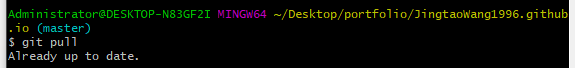

Some git usage experience.

# Git 

相关必要安装内容：git & turtoist

## Git 命令行提交代码步骤

1、cd 到git项目目录（会看到一个分支信息，此处是master）

2、拉取服务器代码，更新本地代码：git pull （下图表示代码为最新版）

3、查看当前本地项目哪些文件被修改过：git status 

具体状态如下：

Untracked: 未跟踪,一般为新增文件，此文件在文件夹中, 但并没有加入到git库, 不参与版本控制. 通过git add 状态变为Staged.

Modified: 文件已修改, 仅仅是修改, 并没有进行其他的操作.

deleted： 文件已删除，本地删除，服务器上还没有删除.

renamed：

4、将状态改变的代码提交至缓存：git add .

使用上面的命令将所有的修改的文件提交到缓存区

git add + 文件

git add -u + 路径：将修改过的被跟踪代码提交缓存

git add -A + 路径: 将修改过的未被跟踪的代码提交至缓存

例如：

git add -u vpaas-frontend/src/components

将 vpaas-frontend/src/components 目录下被跟踪的已修改过的代码提交到缓存中

git add -A vpaas-frontend/src/components

将 vpaas-frontend/src/components 目录下未被跟踪的已修改过的代码提交到缓存中

5、将代码提交到本地仓库中：git commit –m “注释”
------
