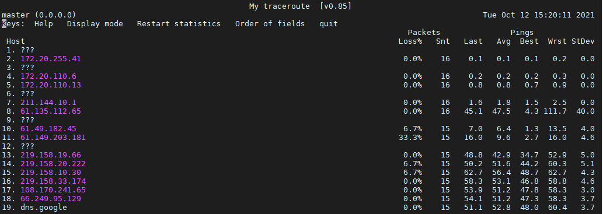

Some linux usage experience.

# 常用客户端工具

## mobaXterm

破解版可无限保存ssh记录

### 问题记录

* linux 服务器连接断开

  * 修改 /etc/ssh ssh_config 与 sshd_config 区别

    ssh_config 是针对客户端的配置文件  &  Sshd_config 是针对服务器的配置文件

  *  sshd_config 可以配置是否需要密码登录：PasswordAuthentication yes

* ssh 连接报错：Network error software caused connection abort

  * vim /etc/ssh/sshd_config 
  * 找到 TCP KeepAlive yes 把前面的 # 去掉
  * 找到ClientAliveInterval 参数去掉前面的#【该参数指定了服务器端向客户端请求消息的时间间隔，默认是0，不发送。ClientAliveInterval 60 表示每分钟发送一次，然后客户端相应，这样就保持长连接，比较奇怪的地方是，这里需要服务器主动发出请求，而不是客户端。正常情况下，ClientAliveCountMax】

# 文件操作命令

* 统计某文件中某内容出现次数：grep -o 内容 文件名 \| wc -l
* 统计某文件行数：wc -l 文件名
* 查看某文件中某内容对应的行：grep -n "内容" 文件名
* 复制文件：cp 当前文件路径 新复制文件路径 
* 将某个文件前m行移到另一个文件中：head -m a.txt > b.txt
* 删除文件/文件夹
  * 删除文件：rm -f 文件路径
  * 删除文件夹：rm -rf 文件夹路径 
* 移动/重命名文件
  * 重命名文件：mv 当前文件名称 重命名名称
  * 移动文件到目标路径，询问是否覆盖重复文件：mv -i 当前文件路径 目标文件路径
  * 移动文件到目标路径，直接覆盖重复文件：mv -f 当前文件路径 目标文件路径
  * 移动文件到目标路径，备份目标路径重复文件：mv -b 当前文件路径 目标文件路径

* 文件解压
  * tar.gz 文件：tar -zxvf Python-3.8.5.tgz
  * .zip 文件： unzip 文件名
  * unrar e xxx.rar

* 查看文件第n行内容：
  * 第1行：head -n 1 文件名
  * 第m行： head -m 文件名 

* 文件编辑：vim
  * 进入并编辑：cd到指定目录    vim 文件名     按insert 或 i 之后开始编辑
  * 退出：先按ESC之后      直接退出（：q）强制退出（：q!）保存并退出（：wq）
  * **切换到编辑模式在复制粘贴文件**：按照1）vim 进入之后   按i（进入编辑模式）ctrl+c/v

* 文件or 日志搜索（关键词匹配）：tail -f 
  * 实时刷新日志：tail -f 文件名 \| grep 关键词
  * 实时刷新日志的最新100行：tail -100f 文件名 \| grep 关键词

* 传文件/文件夹: scp
  * 远程服务器上的文件复制到本机: scp root@ip:/path/ /localpath
  * 远程服务器上的文件夹复制到本机：scp -r root@ip:/path/ /localpath
  * 本地文件复制到远程服务器：scp /localpath root@ip:/path
  *  本地文件夹复制到远程服务器：scp –r /local/path root@ip:/path
  *  直接从本地电脑上传文件到远端服务器：scp -p 9854 /cygdrive/待上传文件本地目录 root@localhost：/上传的目标路径

# 进程操作命令

* 查看进程状态：ps -ef\|grep 进程字段or文件名（eg: ps -ef\|grep python3)

  执行后的参数说明例子：

  | 用户名 | pid    | child_pid | CPU占比 | 进程开始时间 | \    | 使用CPU时间 | 进程名  | 文件名 |
  | ------ | ------ | --------- | ------- | ------------ | ---- | ----------- | ------- | ------ |
  | root   | 进程号 | 进程号    | cpu占比 | 具体时间     | \    | 具体时间    | python3 | a.py   |

* 杀死、批量杀死进程

  * 杀死某个进程：kill -9 pid
  * 正常退出某个进程：kill -15 pid
  * 批量杀死某个文件名对应的所有进程（cd 到文件所在路径后）：pkill -f 文件名 

* 后台不挂断运行代码：nohup

  * nohup 可以不挂断同时执行多个代码  & 执行后的打印全部存入nohup.out文件，一直积累不自动删除

  * 命令格式：nohup 解释器 文件名 & (eg:nohup python3 new_main.py & 或 nohup java -jar xxx.jar &）

  * 输出重定向：nohup 输出重定向到 /dev/null() 后不会产生 nohup.out 文件

    ​    eg: nohup python3 new_main.py >/dev/null 2>&1 & 

* 查看后台运行任务：jobs -l 
* 查找某个进程pid：pidof python3

# 系统资源查看命令

* 端口占用：netstat –anp\|grep 端口号
* 端口是否已对外开放: netstat -ntulp \| grep 端口号
* 指定端口是否已开放：firewall-cmd –query-port=666/tcp（yes 已开启）
* cpu信息：lscpu
* linux 系统版本号：cat/proc/version
* 服务器cpu数
  * 物理CPU：cat /proc/cpuinfo\|grep “physical id”\|sort –u\|wc –l
  * 每个物理CPU中的核数：cat /proc/cpuinfo\|grep “cpu cores”\|uniq
  * 逻辑cpu：cat /proc/cpuinfo\|grep “processor”\|wc -l
  * Cpu名称型号：cat /proc/cpuinfo\|grep “name”\|cut –f2 –d:\|uniq

* 内存占用

  * 最大命令：free -h   【free -h -s 2 每2s自动执行一次该命令】

  * 某个进程的内存占用：ps -aux\|grep python3(进程名)

  * 更详细的内存占比： cat /proc/进程号/status: VmRSS为进程所占用的内存

  * top命令，之后按M：所有进程按照内存占用大小排序

    top 命令，之后按P：所有进程按照CPU占用排序。

* 磁盘占用情况：df 

  执行之后可以用于查看具体文件的占用

  * 返回根目录：cd /
  * 确认具体那个文件占用磁盘较大：du -h -x --max-depth=1

​         PS: df -h 没有发现大文件之后的查询思路：**lsof -n grep deleted**，找到对应进程号后杀掉[参考](https://www.cnblogs.com/muchengnanfeng/p/9554993.html)

* 进程运行在哪个逻辑CPU上：ps -eo pid，args，psr \|grep nginx
* linux 下的python console 交互
  * 查看当前python连接：ll /usr/bin/grep python
  * 进入命令行模式：python3
  * 退出命令行模式：ctrl+D

# 网络相关命令

* 通断性：ping ip （python 多目标异步发送icmp包进行ping的库：multiping）
* 网络跳数：traceroute ip/域名
  * 说明：通过向目标主机发送一条消息并通过会带来判断主机状态，遍历由源主机到目的主机的交互线路上所有的路由器并判断状态，一般以30为最大TTL，即以该线路上不超过29台路由器为前提进行遍历。
  * 基本原理：当路由器收到一份IP数据报，若该报文的ttl字段是1，则该报文的生存周期消耗殆尽，本路由处理后还未到达目标主机则需要将该数据丢弃，并给信源主机发送一份ICMP超时报文（包含中间路由器地址），这意味着：通过发送一份TTL字段为n的IP数据报给目的主机，就得到了该路径中的第n个路由器的IP地址，那么我们使IP数据报的TTL字段值从1开始递增，就可以获得所有中间路由的IP地址。由于已经到达目的主机，因此不会再发送ICMP应答报文，通过区分收到的ICMP报文是超时报文（type = 11）还是应答报文（type = 0）以判断程序应该何时结束。[每一次发包ttl从1开始增加，在一次traceroute过程当中，从源主机出发，每次经过1个路由则ttl-1，为0时返回本次所有路由状态，然后进入下一次发包。]
  * **最大30跳**，每个记录1跳，每一跳表示一个网关，3个时间表示发送的三个包网关相应后的返回时间。 

* mtr命令：（ping+traceroute)

  * 命令格式：mtr ip

    

    查看traceroute 路径，丢包率，平均解析时延等，通过这条命令结合实际情况观察路径上的丢包情况等。

* 网络是否通畅\|：\| ip

  * 通过url执行上传或下载

  * \| --h  查看help 文件命令执行方式。

  * \| --k  跳过ssl 认证环节。

  * \| –data-urlencode()  url 编码的数据

  * \| url：port/path  查看当前路径内容。

    使用示例

  * \| –k https://ip:443

* bgpdump：linux解析bgp报文命令，[安装步骤](https://blog.csdn.net/weixin_35708669/article/details/89442180)

* iptable

  ifconfig 确定网卡名称后

  * 53的tcp 和 udp **重定向**到5053

    iptables -t nat -A PREROUTING -i enp125s0f0 -p tcp --dport 53 -j REDIRECT --to-ports 5053

    iptables -t nat -A PREROUTING -i enp125s0f0 -p udp --dport 53 -j REDIRECT --to-ports 5053

  * 查看iptable 规则：iptables -t nat -L -v -n

  * 删除某条规则

    规则行号：iptables -t nat -L -n --line-numbers

    根据num行号确定删除规则： iptables –t nat –D INPUT 第几条规则

​              PS: 若报错iptables：index of deletion too big，则需要明确要删除的表（ iptables -t nat -D PREROUTING 第几条规则）

* 防火墙操作

  * 查看防火墙状态: systemctl status firewalled

  * 开启防火墙：systemctl start firewalled // service firewalled start

  * 关闭防火墙：systemctl stop firewalled

    若遇到无法开启防火墙的情况

  * 先 systemctl unmask firewalled.service

  * 再 systemctl start firewalled.service

* telent：telnet ip port

# 其他命令

## ssh 建隧道

* 建隧道例子：ssh -f -N -L 9988:211.144.18.3:20022 root@10.42.25.13  
  *  将跳板机（211.144.18.3：20022）通过9988端口映射到本地13
  * ssh -f -N -L 9854:172.20.10.46:22 common@localhost -p 9988 
  * 将通过跳板机连接的目标服务器（172.20.10.46:22）通过9854端口映射到跳板机的端口9988，进而映射到本地

* 直接从本地电脑上传文件到远端服务器---完成上述映射之后: scp -p 9854 /cygdrive/待上传文件本地目录 root@localhost：/上传的目标路径

* 跳板机（13）传文件到远程目录下
  *  文件传到13 root 目录下
  *  scp -P 20022 dnspython.conf common@211.144.18.3:/home/common
  * 控制节点 /home/common 再scp

## 任务绑定CPU

当多个进程争抢一个CPU资源（或1个CPU资源分配了多个进程，前几个进程执行时资源耗尽）导致代码耗时不稳定，[参考](https://blog.csdn.net/qq_30683329/article/details/88779390)

* CPU 亲和力：CPU affinity是一种调度属性(scheduler property), 它可以**将一个进程"绑定" 到一个或一组CPU上**.在SMP(Symmetric Multi-Processing对称多处理)架构下，Linux调度器(scheduler)会根据CPU affinity的设置让指定的进程运行在"**绑定"**的CPU上,而不会在别的CPU上运行。**Linux调度器同样支持自然CPU亲和性(natural CPU affinity): 调度器会试图保持进程在相同的CPU上运行, <u>这意味着进程通常**不会在处理器之间频繁迁移,进程迁移的频率小就意味着产生的负载小。</u>

  因为**程序的作者比调度器更了解程序,所以我们可以手动地为其分配CPU核，而不会过多地占用CPU0，或是让我们关键进程和一堆别的进程挤在一起,**所有设置CPU亲和性可以使某些程序提高性能。

* CPU核心表示方法

  CPU affinity 使用位掩码（bitmask）表示，每一位都表示一个CPU

  最低位表示第一个逻辑CPU,最高为表示最后一个逻辑CPU

  CPU affinity 典型的表示方法是使用16进制：

  1）0x00000001   is processor #0

  2）0x00000003   is processors #0 and processor #1

  0Xfffffffff      is all processors

* 

# 操作系统

centos、debian等操作系统使用时遇到的问题记录

## Debian 装GUI图形界面

* sudo su –
* 更新debian系统： apt update & apt –y upgrade
* GNOME 使用一下命令安装桌面环境【耗时】：apt –y install task-gnome-desktop
* 上一步完成后，分配graphical runlevel：systemctl set-default graphical.target
* 默认情况通过GNOME 显示管理器GDM禁用root用户登录，去掉限制：
  * vi /etc/pam.d/gdm-password
  * 注释掉：# auth  required pam_succeed_if.so user !=root quite_success
* 重启debian服务器：reboot
* 参考：搜索“如何为debian11安装图形用户界面GUI"

------

