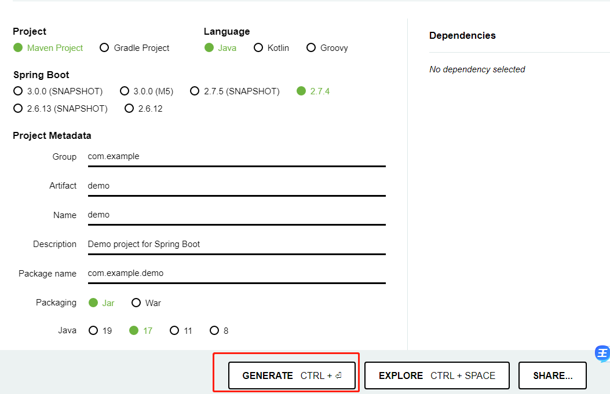
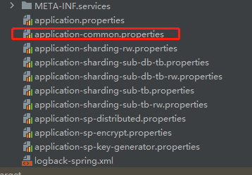
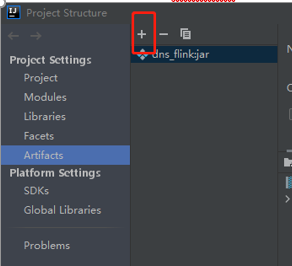
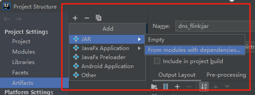
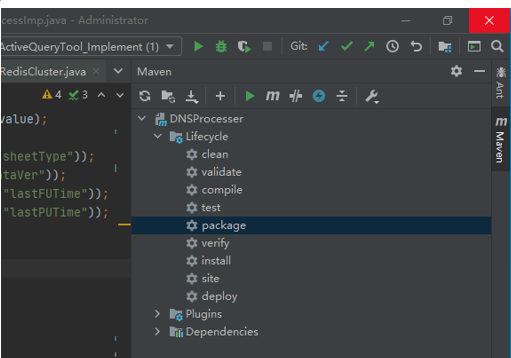

Some Java usage experience.

# 命名规则

* 包命名：统一小写字母，最新Java编程规范中要求开发人员自定义的包名前加上唯一的前缀，由于互联网公司的域名不会重复，因此多用包的格式前缀：**公司名.项目名.模块名.***    eg：package com.cetc.项目模块名.*;

* 类命名: **大驼峰命名形式（单词首字母大写）**若多个单词组成，则每个单词首字母大写，若包含缩写，则每个字母均大写。eg：public class ClassNameExample{}

* 方法名：采用**小驼峰形式，首字母小写**，如果由多个单词组成，第一个首字母小写，其余单词首字母大写。

* 变量名：

  * 首字母小写，接下来的单词大写开头

  * 首字母大写，接下来的单词大写字母开头

* 常量名：全部采用大写形式

* 命名原则：

  * 名称只能由字母、数字、下划线、$符号组成，不以数字开头
  * 名称不使用java 关键字，比如char、double、if、for、else
  * 不允许使用中文及拼音名称。

* 项目命名规范：最好全英文、所有单词小写（下划线不一定）

# 基本配置

[参考内容](https://www.runoob.com/java/java-environment-setup.html)

* jar 包运行命令：java -jar xxx.jar
* java 目前稳定版：1.8

## 开发环境配置

* windows

  * JDK [下载安装配置](https://www.oracle.com/java/technologies/downloads/),JDK下载过程中JRE可以一并安装

  * 安装完成后：我的电脑->属性->高级系统设置->高级->环境变量->系统变量

    PS: 设置三项属性：JAVA_HOME、PATH、CLASSPATH(大小写无所谓),若已存在则点击"编辑"，不存在则点击"新建".

  * 测试JDK运行是否成功：开始->win+R->cmd->java\javac\java –version 有版本输出表示正确。

  * Java末尾基本都有分号（；）

  * 注释： // 或者 /\*中间的每一行前加*表示注释\*/

      PS：空行或者有注释的行，java编译器都会忽略掉

## 工程导入

* git 拉取代码
* IJ 配置Maven：file->setting ->Build,Execution,Development->Build Tools ->Maven
  * Maven Home Path：写到Maven路径的bin层【eg：E:/apache-maven-3.6.3-bin/apache-maven-3.6.3/bin/..】
  * User settings file：明确settings.xml 文件路径 【**mirrors换源更新到国内源，可以拷贝正常运行的工程的该文件到本地替换**】
  * Local repository：本地仓库位置，下载Maven的时候配置。

## linux服务器配置java环境

* root登录
* 安装java JDK

  * 更新包软件库：sudo apt-get update。
  * 安装jdk：sudo apt-get install default-jdk [此命令无需单独配置环境变量。]
  * 查看是否安装成功：java -version.

## java在不同版本中切换

* [基于环境变量切换](https://blog.csdn.net/ZZZZhaoYiDing/article/details/136532959)

## 前端文件打包在springboot当中同时启动

**springboot启动的同时启动前端页面**，[ref](https://blog.csdn.net/Mrzhang567/article/details/125527153)

* 在springboot的resource目录下创建static文件夹。
* 将前段打包后的dist文件夹下的所有文件全部拷贝到static文件夹下。
* 启动springboot，访问8080端口来检查前端文件是否被正常加载。

# 基本语法

* **java 文件名和主函数所在的类名一定要一致，否则无法运行**

* 构造方法：每个class 当中一定有构造方法，如果没有显示的定义类构造方法，则会默认构造方法。创建class的时候至少需要一个构造方法(class 中必须要有一个def）

* 创建对象

  * 声明：Java需要声明一个对象，包括名称和类型
  * 实例化：关键字new来创建一个对象
  * 初始化：new之后，调用class的构造方法来初始化对象    eg：Method myMethod = new Method();

* 修饰符

  * private 同一类可见
  * public 所有类可见
  * protected 同一包内的类和所有子类可见
  * default 默认，在同一包内可见，用于class，接口、变量、方法
  * static 静态
  * final 变量一旦被赋值后不能重新赋值

* 数据类型

  * char类：char ch = "a"   --- 操作单个字符
  * string & stringBuffer类：String str = ”aaa“
  * 数组--必须声明数组类型：type[] name = {};   eg: double[] mylist = {1.1,2.1,3.1}

* 异常处理： Try{}catch(){}finally{} 同py

* 关键字

  * this：当成员变量和局部变量重名时，在方法中使用this，表示的是该方法所在类中的成员变量

    构造函数的时候，通过this可以调用同一类中别的构造函数

* 接口&实现

  * 接口关键词：interface
  * 实现关键词：implements
  * 接口实现必须实现接口所有的方法，否则用abstract

# 进阶方法

## 单例模式

避免java多次访问某个类时重复new该类增大消耗，[参考](https://www.runoob.com/design-pattern/singleton-pattern.html)

## 序列化serialize

* 处理对象流的机制，将对象的内容进行流化，将数据分解成字节流，便于存储或是在网络上进行传输。

* Java 数据的存储形式都是对象，没有办法直接在网络中进行传输，所以需要序列化，且要求序列化可逆。【java 通过Serializable 接口进行实现】

* 第三方序列化方式：FastJson、Json、Protobuff 序列化。

​       PS: 静态statics 属性不会被序列化。

## 克隆

Java 直接复制只是复制索引，不能复制object，复制需要用clone来完成-**类似深浅拷贝**

具体使用,[参考](https://baiyuliang.blog.csdn.net/article/details/109250816)：

* class 中重写clone方法

  ```java
  public class Example implements Cloneable{
     @override
     public Object clone() throws CloneNotSupportedException{
         return super.clone();
     }
  }
  ```

* 调用该类时，直接.clone()

## 日志

import下面两个jar包,然后直接在logger里面增加

```Java
// 引入slf4j接口的logger和loggerFactory
import org.slf4j.Logger
import org.slf4j.LoggerFactory;

public class UserService{
    //声明一个logger，statistc的方式
    private final static Logger logger = LoggerFactory.getLogger(UserService.class);
    public Boolean verifyLoginInfo(String name, String password){
        logger.info(“start to verify aaaaaaa”);
        return false;
    }
}
```

## XML接口文档

* xml 负责数据的传输和存储，html 用来显示数据。Xml 是独立于软件、硬件的信息传输工具、

# spring-boot

**[创建java1.8版本的springboot](https://start.aliyun.com/)**

[参考](https://baiyuliang.blog.csdn.net/article/details/109250816)

## 创建spring-boot项目

官方推荐：[参考](https://start.spring.io/)




上述内容选择好后直接generate，然后用开发工具打开

## 查看spring-boot 版本

* pom.xml 文件中搜索“org.springframework.boot”, 找到类似的部分中的version即为springboot版本

  ```xml
  <parent>
      <groupId>org.springframework.boot</groupId>
      <artifactId>spring-boot-starter-parent</artifactId>
      <version>2.0.3.RELEASE</version>
      <relativePath/>
  </parent>
  ```

*  对应springboot 与 springboot-plugin 插件情况

* 

## spring-boot项目结构 

* 启动类：/src/main/java/com.cetc.项目名（公司域名.项目名），这个目录下为启动类
* **/src/main/java/工程名称/Application class 为整个springboot文件主函数入口**
* /src/test/下为测试类
* pom.xml：maven 配置文件，所有springboot相关模块的引入
* /src/main/resource/ application.properties：应用配置文件，比如项目名、数据库连接、redis连接等等，基本上所有的项目配置选项，都在这里配置；【可以用.yml 替换，yml注意缩进机制】

## controller/service/dao/entity层

* Controller层：控制业务层Service，主要是建立与外界业务沟通，前端调用接口访问相关业务都会通过controller，由controller调用相关业务层代码并把数据返回给前端

  * [两种写法](https://baiyuliang.blog.csdn.net/article/details/109254387)

  ​      @Controller+@RequestMapping+@ResponseBody

  ​      @RestController+@GetMapping(PostMapping,PutMapping 方式)

  * @Controller & @RestController

  ​       如果使用**@Controller** **就必须指明方法中的返回数据类型**，如@ResponseBody。可以返回指定数据格式的数据，也可以返回具体网页路径。

  ​       @RestController 只能返回json等固定格式数据，不能再返回html等页面

  ​       @RestController = @Controller+@ResponseBody组合（注解如上右图）

  ​      说明：

  ​      * 不管是上述两种哪一种，均在Contorller类当中新增具体的方法作为接口，和service层交互。

  ​      * 在为前端写端口时，常用@Restcontroller

   **@RequestMapping**

  实际开发过程中，经常划分业务模块，因为在书写controller时，会为controller里所有方法定义一个父级RequestMapping，如下图的 /test 模块，项目当中是API模块，

* Service层：业务层/服务层，所有内部的业务逻辑，都在service层，比如：用户增删改查、验证码等等，业务层由数据进行支持，实现controller的所有接口

* Dao层：数据库持久化层，与数据库交互，常用框架：JPA（springboot官方）、MyBatis

    --- 项目复杂程度一般、追求稳定、迭代速率低（JPA）

    --- 项目复杂、需求变更频繁，迭代速度快（mybatis）

* controller不允许直接操作数据库，只能和service交互, 中间转发者，不在controller暴露service层逻辑，直接return service处理结果

* 一个controller对应一个service，一个service对应一个Dao；复杂情况，一个controller可以调用多个Service

* controller层、service层均不允许互调

## spring-boot项目运行

 运行成功log信息会提示tomcat 版本号和端口号，然后浏览器输入： http：//localhost:8080/

## swagger调试

前后端接口联调，登录配置好的swagger接口测试界面后，找到对应接口发送输入数据测试后端controller.

* localhost:8081/doc.html

* 每次调试都需要重新运行application class启动整个springboot项目进行调试,如果有报错，则一定会同步执行

## 注解说明

* 所有注解格式：@xxxxx

* @Getmapping & @Postmapping

  * Getmapping:查询操作
  * PostMapping: 新增、编辑、删除等内容修改操作

* @RequestBody

  将前端传来的json格式的数据转为自己定义好的javaBean 对象，需要注意的是传入数据的属性名称要和后端javabean中定义的一致，发送请求后可以看到通过javabean对象的get方法打印出了前端传来的值

## 前后端联调

* F12, google 浏览器查看传参情况，调用具体接口的情况

​       F12->network ->看具体请求接口的header（参数）、payload、response

## springboot后端服务打jar包后运行

见下方**IJ打jar包**

* jar包上传服务器后：java -jar xxxx.jar [尝试前端运行是否报错。]

### 运行jar包时指定外部配置文件：xxx.properties

java -jar your-app.jar --spring.config.location=file:/path/to/external/application.properties

* 方便直接修改相关配置

PS: 若工程包含lombok，则--spring之后的参数配置会被认为是lombok的，导致失效，需修改为为：

**java -jar -Dspring.config.location=file:/cyd/application.properties /cyd/middleProcess-0.0.1-SNAPSHOT.jar**

# IJ

打jar包

## Maven project

* profiles 简介：maven 当中的profiles 表示不同的运行环境

对应pom文件中profiles的相关配置




## pom文件详细说明

* dependencies: Java 工程的相关依赖 

```
<dependnecies>
    <dependency>
        <groupId>org.apache.shardingsphere</groupId>
        <artifactId>sharding-jdbc-spring-boot-starter</artifactId>
        <version>${sharding-version}</version>
    </dependency>
    ...
</dependnecies>    
```

* properties: Java 版本号，相关关键组件的版本号

```
<properties>
     <java.version>1.8</java.version>
     <nacos-verison>1.4.1</nacos-verison>
     <sharding-version>${sharding-version}</sharding-version>
</properties>    
```

* profiles：Java 配置的不同环境

```
<profiles>
    <profile>
        <id>org.apache.shardingsphere</id> # 环境类型
        <properties> # 对应的properties文件名称
           <profileActive>sharding-rw</profileActive>
        </properties>
    </profile>
    ...
</profiles>    
```

* build 下：resource 当中的directory为工程文件位置

## 打jar包

* 方法1

  * IJ中，ctrl +alt+shift+s，进入下图界面，点击+号

    

  * 进入路径设置

    

  * 设置入口函数和jar包位置

  * apply->ok

  * IJ 最顶部一行：build->build artifacts->选择好具体jar包后，在action进行打包

  * 找到jar包位置，传入服务器进行后续操作

* 方法2：右侧maven-packages

  

# java 调用python脚本及第三方库

## jython

### 安装配置

[教程](https://blog.csdn.net/master_hunter/article/details/127528487)

* [下载](https://www.jython.org/download)

* [环境变量配置](https://testgo.cn/601.html)

* 添加maven依赖

  ```
  <dependency>
              <groupId>org.python</groupId>
              <artifactId>jython-standalone</artifactId>
              <version>2.7.3</version>
  </dependency>
  
  ```

* 运行python语句：

  ```java
  import org.python.util.PythonInterpreter;
   
  public class HelloPython {
      public static void main(String[] args) {
          PythonInterpreter interpreter = new PythonInterpreter();
  //        interpreter.exec("print('Hello python')");
          PySystemState sys = Py.getSystemState();
          sys.path.add("D:\\anaconda3\\Lib\\site-packages");
          interpreter.execfile("tle.py"); // python 脚本路径
      }
  
   
  }
  ```

* 运行python脚本（带第三方库）

  ```java
  import org.python.util.PythonInterpreter;
   
  public class HelloPython {
      public static void main(String[] args) {
          PySystemState sys = Py.getSystemState();
          sys.path.add("D:\\anaconda3\\Lib\\site-packages");
          interpreter.execfile("E:\\项目相关\\starlink\\starlink\\src\\main\\resources\\python\\tle.py"); // python 脚本路径
      }
  }
  ```

# 问题记录

* 报错：ij报缺少某个类，但实际文件是存在的

  解决方案：file->reload from sdk

* 报错：java环境变量后不生效的问题

  解决方案：[参考](https://www.runoob.com/java/java-environment-setup.html)

  * cmd 后where java
  * 删除最上面默认位置的文件
  * java -version 验证

* 报错：idea标红无法识别

  解决方案：首先考虑[pom文件是否添加依赖](https://blog.csdn.net/xiaojutu/article/details/118218123),网上搜索dependency添加到pom.xml 之后import

* 报错：@Getmapping not applicable to type

  解决方案：@Getmapping的注解是加在方法上面，而不是class类上面

* 报错：Cannot resolve symbol xxxxxxx)springframework

  解决方案：大概率是maven没有配置或加载好，去pom.xml 当中右键标红的地方->maven->reload project & generate source

* 报错：不支持发行版本5

  解决方案：IJ当中file->project Structure->查看project & Modules的版本是否与本地一致,若不一致，对应修改为本地的11


------

