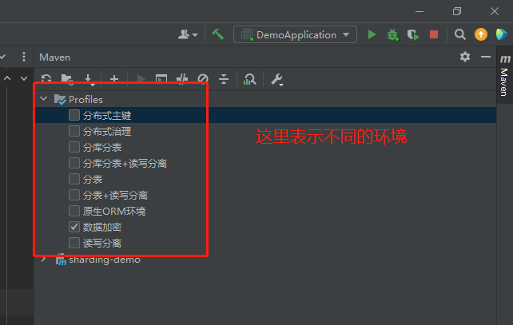
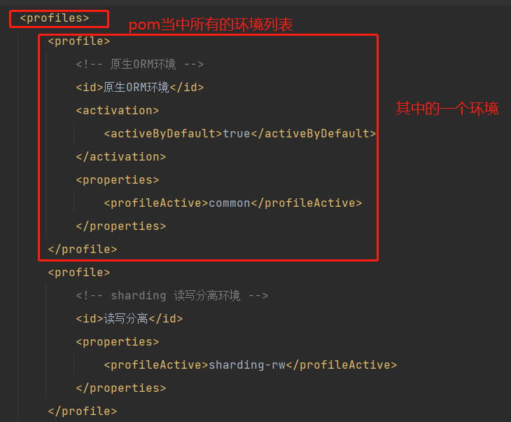

Some Java usage experience.

# 命名规则

* 包命名：统一小写字母，最新Java编程规范中要求开发人员自定义的包名前加上唯一的前缀，由于互联网公司的域名不会重复，因此多用包的格式前缀：**公司名.项目名.模块名.***    eg：package com.cetc.项目模块名.*;

* 类命名: **大驼峰命名形式（单词首字母大写）**若多个单词组成，则每个单词首字母大写，若包含缩写，则每个字母均大写。eg：public class ClassNameExample{}

* 方法名：采用**小驼峰形式，首字母小写**，如果由多个单词组成，第一个首字母小写，其余单词首字母大写。

* 变量名：

  * 首字母小写，接下来的单词大写开头

  * 首字母大写，接下来的单词大写字母开头

* 常量名：全部采用大写形式

* 命名原则：

  * 名称只能由字母、数字、下划线、$符号组成，不以数字开头
  * 名称不使用java 关键字，比如char、double、if、for、else
  * 不允许使用中文及拼音名称。

* 项目命名规范：最好全英文、所有单词小写（下划线不一定）

# 基本配置

[参考内容](https://www.runoob.com/java/java-environment-setup.html)

* jar 包运行命令：java -jar xxx.jar
* java 目前稳定版：1.8

## 开发环境配置

* windows

  * JDK [下载安装配置](https://www.oracle.com/java/technologies/downloads/),JDK下载过程中JRE可以一并安装

  * 安装完成后：我的电脑->属性->高级系统设置->高级->环境变量->系统变量

    PS: 设置三项属性：JAVA_HOME、PATH、CLASSPATH(大小写无所谓),若已存在则点击"编辑"，不存在则点击"新建".

  * 测试JDK运行是否成功：开始->win+R->cmd->java\javac\java –version 有版本输出表示正确。

  * Java末尾基本都有分号（；）

  * 注释： // 或者 /\*中间的每一行前加*表示注释\*/

      PS：空行或者有注释的行，java编译器都会忽略掉

# 基本语法

* **java 文件名和主函数所在的类名一定要一致，否则无法运行**

* 构造方法：每个class 当中一定有构造方法，如果没有显示的定义类构造方法，则会默认构造方法。创建class的时候至少需要一个构造方法(class 中必须要有一个def）

* 创建对象

  * 声明：Java需要声明一个对象，包括名称和类型
  * 实例化：关键字new来创建一个对象
  * 初始化：new之后，调用class的构造方法来初始化对象    eg：Method myMethod = new Method();

* 修饰符

  * private 同一类可见
  * public 所有类可见
  * protected 同一包内的类和所有子类可见
  * default 默认，在同一包内可见，用于class，接口、变量、方法
  * static 静态
  * final 变量一旦被赋值后不能重新赋值

* 数据类型

  * char类：char ch = "a"   --- 操作单个字符
  * string & stringBuffer类：String str = ”aaa“
  * 数组--必须声明数组类型：type[] name = {};   eg: double[] mylist = {1.1,2.1,3.1}

* 异常处理： Try{}catch(){}finally{} 同py

* 关键字

  * this：当成员变量和局部变量重名时，在方法中使用this，表示的是该方法所在类中的成员变量

    构造函数的时候，通过this可以调用同一类中别的构造函数

# spring-boot

[参考](https://baiyuliang.blog.csdn.net/article/details/109250816)

## 创建spring-boot项目

官方推荐：[参考](https://start.spring.io/)


上述内容选择好后直接generate，然后用开发工具打开

# IJ

打jar包

## Maven project

* profiles 简介：maven 当中的profiles 表示不同的运行环境



对应pom文件中profiles的相关配置




## pom文件详细说明

* dependencies: Java 工程的相关依赖 

```
<dependnecies>
    <dependency>
        <groupId>org.apache.shardingsphere</groupId>
        <artifactId>sharding-jdbc-spring-boot-starter</artifactId>
        <version>${sharding-version}</version>
    </dependency>
    ...
</dependnecies>    
```

* properties: Java 版本号，相关关键组件的版本号

```
<properties>
     <java.version>1.8</java.version>
     <nacos-verison>1.4.1</nacos-verison>
     <sharding-version>${sharding-version}</sharding-version>
</properties>    
```

* profiles：Java 配置的不同环境

```
<profiles>
    <profile>
        <id>org.apache.shardingsphere</id> # 环境类型
        <properties> # 对应的properties文件名称
           <profileActive>sharding-rw</profileActive>
        </properties>
    </profile>
    ...
</profiles>    
```

* build 下：resource 当中的directory为工程文件位置

## 打jar包

* 方法1

  * IJ中，ctrl +alt+shift+s，进入下图界面，点击+号

    

  * 进入路径设置

    

  * 设置入口函数和jar包位置

  * apply->ok

  * IJ 最顶部一行：build->build artifacts->选择好具体jar包后，在action进行打包

  * 找到jar包位置，传入服务器进行后续操作

* 方法2：右侧maven-packages

  

## 问题记录

* 报错：ij报缺少某个类，但实际文件是存在的

  解决方案：file->reload from sdk


------

